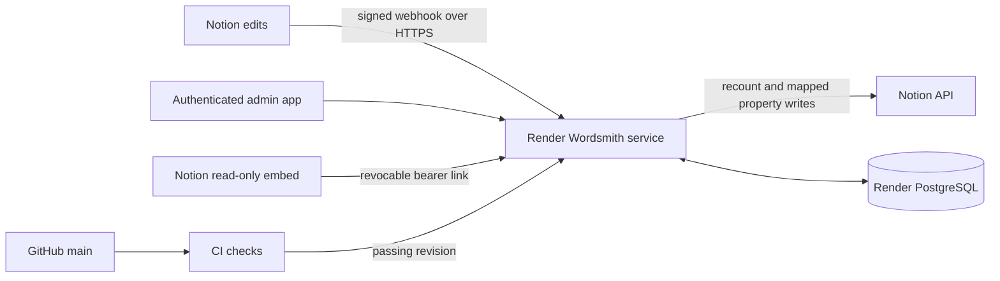

# Production deployment

Implementation is prepared for hosting. No hosting resources have been created, no payment details have been used, and the computer-off release gate is still pending. Complete the checkpoints below in your own account. Never paste credentials into Codex/chat.

## Provider and architecture

Use one paid Render Node web service and paid Render PostgreSQL 18 in Ohio. The service serves the built React admin app, API, webhook ingress and read-only embed on one HTTPS origin. One process performs the durable inbox work. Native Node hosting avoids requiring Docker on the development computer.

The committed `render.yaml` requests one `0.5c-512mb` web instance and one `0.1c-256mb` PostgreSQL instance with 1 GB of storage. Review the actual recurring compute/storage charges in the Render creation screen before deploying. These are paid resources in your account. There is no account connection or authority here to pay on your behalf. See [current pricing](https://render.com/pricing) and [plan identifiers](https://render.com/docs/compute-plans).

Paid web instances remain running; Render's free web instances sleep and free databases expire, so those plans do not satisfy this release. The platform supplies TLS, runtime configuration, logs and deployment controls. [Service behavior](https://render.com/docs/faq), [web services](https://render.com/docs/web-services).

## Checkpoint A: hosting

1. Wait for this revision's GitHub **CI / checks** job to pass. Do not deploy a failing revision.
2. In the repository root, run `npm run admin:credentials`. Open the ignored `.wordsmith-admin-credentials` file locally. Keep `ADMIN_PASSWORD` in your password manager; the server will receive only its scrypt hash. The command never prints the values and refuses to overwrite an existing file.
3. Open [Render Dashboard](https://dashboard.render.com/) in your own account. Choose **New > Blueprint**, connect GitHub, and choose `gmarnold/wordsmith-notion-writing-pulse`. Use branch `main`, Blueprint path `render.yaml`, and a name such as `wordsmith-production`.
4. Review the proposed paid web service and paid database. The repository root directory must remain the repository root, not `apps/api`. Build command: `npm ci --include=dev && npm run build`. Pre-deploy command: `npm run db:migrate:production -w @wordsmith/api`. Start command: `npm start`. Health-check path: `/api/health`. Node version: 22.
5. Enter the prompted environment values in Render: your existing internal `NOTION_TOKEN`, the locally generated `ADMIN_PASSWORD_HASH`, the locally generated `SESSION_SECRET`, and `NOTION_WEBHOOK_SETUP=true`. Do not set `ADMIN_PASSWORD` on the server. Do not copy your entire local `.env`.
6. Only if you accept Render's displayed charges, choose **Deploy Blueprint**. This is the step that creates billable resources. [Blueprint creation instructions](https://render.com/docs/infrastructure-as-code).
7. Once created, set the Blueprint's **Auto Sync** to **No**. Normal code deployments use the service's **After CI Checks Pass** setting; changes to infrastructure must be manually synced after CI passes. This avoids automatic Blueprint changes bypassing the application CI gate.
8. Open the web service and copy its actual public HTTPS URL. Do not assume the name is exactly `wordsmith.onrender.com`; Render may add a suffix. The app explicitly uses Render's supplied `RENDER_EXTERNAL_URL` as its production origin unless you override `PUBLIC_ORIGIN`.
9. Open `https://ACTUAL-HOST/api/health`. It must return HTTP 200, `status: "ok"`, `database: "connected"`, and `notionConfigured: true`. `webhookConfigured` stays false until checkpoint C. Open the base URL and sign in with the generated admin password.
10. Save the password and hosting values securely, then remove the ignored local credential file. Send only the public base URL and setup status back to Codex if assistance is needed.

No provider API key is required in GitHub or in chat. [Render's native CI integration](https://render.com/docs/deploys) detects GitHub Actions results; `autoDeployTrigger: checksPass` is committed in the Blueprint. A manual/initial deploy must also use a revision you have confirmed passed CI.

## Checkpoint B: database

The Blueprint creates `wordsmith-postgres` in the same region and supplies its internal connection string to the service as `DATABASE_URL`. Verify that reference in the web service's Environment page; no password needs to be copied anywhere else. External database access is disabled by `ipAllowList: []`.

If creating the resources manually, create a paid Render Postgres database in Ohio, then set the web service's `DATABASE_URL` in its Environment page to the database's **Internal Database URL**. Keep both services in the same account and region. Never paste that URL into chat. [Render PostgreSQL connection instructions](https://render.com/docs/postgresql-creating-connecting).

The pre-deploy command runs all numbered SQL files in order under a transaction and PostgreSQL advisory lock. The ledger stores filenames, normalized SQL checksums and application times. Existing handwritten initial schemas are adopted without resetting manuscripts. Earlier ledgers without checksums are upgraded once. Never modify an applied migration; add the next numbered file instead. A checksum mismatch or SQL/connection failure rolls back and exits nonzero, preventing the new deployment. Later deploys run the same command and skip previously applied SQL. There is no production reset command.

Tables retain manuscripts, selected sources, mappings, timezone, all four goals, runs, snapshots, inbox metadata, embed hashes, admin session hashes and single-integration metadata. Temporary webhook verification is encrypted with AES-GCM and cleared once the environment token is configured. Manuscript prose is never persisted. The local database is not uploaded or copied; hosted history begins with a new conservative baseline.

## Production environment

| Variable | Source / role |
| --- | --- |
| `NODE_ENV=production` | Blueprint; selects hosted listener and authentication |
| `PORT` | Render-supplied; listener binds `0.0.0.0` |
| `DATABASE_URL` | Managed database internal connection reference |
| `NOTION_TOKEN` | Existing internal connection, entered only in Render |
| `ADMIN_PASSWORD_HASH` | `npm run admin:credentials`; fixed scrypt parameters |
| `SESSION_SECRET` | Same local generator; random 256-bit value |
| `NOTION_WEBHOOK_VERIFICATION_TOKEN` | Captured at checkpoint C; required for normal operation |
| `NOTION_WEBHOOK_SETUP` | `true` only during initial verification; then `false` |
| `WORDSMITH_DEMO_MODE=false` | Required; production explicitly rejects demo mode |
| `PUBLIC_ORIGIN` | Optional on Render; HTTPS origin for a custom domain or provider override |
| `RENDER_EXTERNAL_URL` | Provider-supplied fallback for the canonical production origin |
| `NODE_VERSION=22` | Build/runtime major selected by the Blueprint |

Local-only `API_PORT`, `PUBLIC_PORT`, `WEB_ORIGIN` and `WEB_PORT` retain the development listeners and Vite proxy. Tests load no local `.env`, use fixture content, and require no real Notion token. Production ignores local environment files. No frontend secret or source edit is needed: browser API paths are relative to the shared origin.

## Checkpoint C: permanent Notion webhook

1. Sign in to hosted Wordsmith. Configure a manuscript at checkpoint D if needed, then open **Settings**. While setup mode is enabled, **One-time webhook verification** appears.
2. Click **Prepare webhook subscription**. Copy the exact displayed HTTPS URL. Its random `setup` query value arms one capture for 15 minutes. This grants no admin access.
3. Open [Notion connection settings](https://www.notion.so/profile/integrations), choose the existing Wordsmith internal connection, then open **Webhooks > + Create a subscription**. Select `page.content_updated`, paste the generated URL and create the subscription. Current instructions are in [Notion's webhook documentation](https://developers.notion.com/reference/webhooks).
4. In hosted Wordsmith, click **Check verification token**, then **Copy verification token**. Paste it into Notion's **Verify** dialog and choose **Verify subscription**. Never paste it into chat.
5. In Render's web service Environment page, add the same token as `NOTION_WEBHOOK_VERIFICATION_TOKEN`, set `NOTION_WEBHOOK_SETUP=false`, and save/redeploy. Leave out quotation marks in the provider UI.
6. Check health again: `webhookConfigured` must now be true. The temporary encrypted capture is cleared at startup. Retain the exact generated subscription URL; its setup query is ignored for signed events after setup. No Cloudflare host belongs in production.
7. Edit a tracked scene's prose. Allow Notion's aggregation window (usually a minute or two), followed by the three-second debounce and up to 15 seconds of widget refresh. Confirm hosted logs show the event, recount, changed property write and successful completion.
8. Only after hosted delivery works, delete the old tunnel subscription to avoid running both local and hosted writers against the same pages. Notion currently requires recreating a verified subscription to change its URL; do not delete the working local subscription before the hosted one is ready.

If the capture expires, prepare a new attempt and update the unverified subscription URL before resending the token. The unsigned handshake requires both explicit setup mode and the unexpired, single-use nonce. It cannot alter the configured signing token. Normal events always require the official raw-byte HMAC verification.

## Checkpoint D: Human or Dancer once

1. Sign in at the production base URL; this app is optional during normal writing.
2. Paste the existing Scenes database/data-source URL into **Notion page or database URL** and click **Inspect manuscript**. The existing connection must have read/update content access to the database and included scenes.
3. Set the name to **Human or Dancer**, select the intended 19 scenes (check the current list rather than assuming it has not changed), and click **Sync now**. The manuscript is saved in managed PostgreSQL.
4. Open **Settings**, map the existing Number **Word Count** property and optional Date **Last Counted** property by their discovered stable IDs.
5. Set `America/Chicago` and your desired daily, weekly, monthly and total manuscript goals. Click **Save settings**, then **Sync now** once to establish mapped counts and the hosted baseline.
6. Reload or sign out/in. The saved manuscript, selected pages, mappings, goals and history must reappear without pasting the URL again. **Open dashboard**, **Settings** and **Sync now** remain available for occasional administration.

The single integration's credentials remain environment-owned. Client creation and the integration metadata table provide a seam for later per-workspace OAuth credentials; public OAuth is not implemented in this release.

## Checkpoint E: production embed

1. In the hosted manuscript's Settings, click **Create embed link**. Copy the exact HTTPS **Embed URL**; it already uses the production origin.
2. Open the Notion project page, type `/embed`, and paste that URL. Position/resize the widget as desired.
3. Verify it shows hosted totals and goals without browser login inside the iframe. Test with an independent signed-out browser if useful.
4. Creating another link rotates access; **Revoke embed** invalidates it. Keep the bearer URL private. Only its SHA-256 hash is stored.
5. Complete [ALWAYS_ON_VALIDATION.md](ALWAYS_ON_VALIDATION.md). Deployability alone is not the release gate.

## Authentication and origins

The admin uses a single scrypt password hash, random signed session cookie, and database session hashes with eight-hour expiry. Cookie attributes are `__Host-`, `Secure`, `HttpOnly`, `SameSite=Strict`, `Path=/`, with no Domain. Logout revokes the database record; password-hash or session-secret rotation invalidates old cookies. Login is bounded to ten attempts per process per 15 minutes and one concurrent password derivation. This intentionally small personal service has no password recovery/account system.

Admin mutations, including login, require the canonical Origin and `X-Wordsmith-Request: 1`. CORS admits only that origin. The public health check, signed webhook and bearer embed are separately accessible. The public HTML/login shell contains no private data; the private API remains protected. Admin HTML cannot be framed; embed framing permits Notion domains and the same origin. The frontend handles session expiry by removing the admin dashboard. Embed access grants no session or configuration privileges.

## Logs, failure recovery and deploys

Open the web service's **Logs** page in Render. Structured metadata includes request/event IDs, page IDs, tracked status, recount run ID, old/new counts, performed/skipped property writes, duration and success/retry status. Categories distinguish signature, database, Notion authentication/rate/access, configuration, sync and property-write failures. Raw bodies, prose, passwords, tokens, connection URLs and bearer paths are not logged by the application. Treat provider access logs and the embed URL as private operational data.

Webhook persistence failures return 503 without acknowledging work. Notion errors preserve previous counts/history and leave the durable job available for retry. Pending work survives redeployment. Stable property IDs are required; a missing/wrong-type property raises a configuration failure rather than selecting a similarly named field. Per-process serialization plus a database advisory transaction lock coordinates recounts during overlapping deploys. Keep one instance; there is no distributed queue platform.

Normal workflow: push `main` → GitHub CI (lint/typecheck/tests/build/browser tests) → Render's **After CI Checks Pass** deploy → migrations → startup readiness → `/api/health` success → traffic. A failed pre-deploy command prevents the new revision from starting. A failed health check blocks cutover. Review **Deploys** and **Logs** for failures. [Health checks](https://render.com/docs/health-checks).

For redeployment, use **Manual Deploy > Deploy latest commit** only after checking CI. For rollback, select a previous successful deployment or **Deploy a specific commit** on the Deploys page. A code rollback does not undo database migrations; current migrations are additive. Never reset the production database. Specific-commit deploys disable automatic deployments; re-enable **After CI Checks Pass** once ready. Environment changes are separate from code rollback. [Rollback behavior](https://render.com/docs/rollbacks).

## Backups and future domains

Paid Render PostgreSQL provides continuous point-in-time recovery; the documented Hobby recovery window is three days (seven on Pro or higher). Use the database **Recovery** page for a restore into a new database and verify it before switching the connection. Keep periodic downloaded logical exports outside the service in your own secure storage, especially before future destructive migrations. Test restoration to a separate database. Local history is not a production backup. [Backups and restore instructions](https://render.com/docs/postgresql-backups).

A later custom domain can be added through Render's domain configuration and DNS instructions. Set `PUBLIC_ORIGIN` to the new HTTPS origin, redeploy, recreate the immutable verified Notion subscription if its URL changes, and rotate/update the embed URL. Keep the provider URL until the new domain is verified.

## Known limits

This is a paid, personal, single-integration deployment. It needs the user's account setup and the computer-off validation before release. There is no public OAuth, multi-user tenancy, automatic enrollment of newly created scenes, historical goal versioning or new analytics feature. One-time hosted reconfiguration intentionally starts a new history instead of silently transferring private local state. Keep PostgreSQL backups and monitor provider billing/availability.
